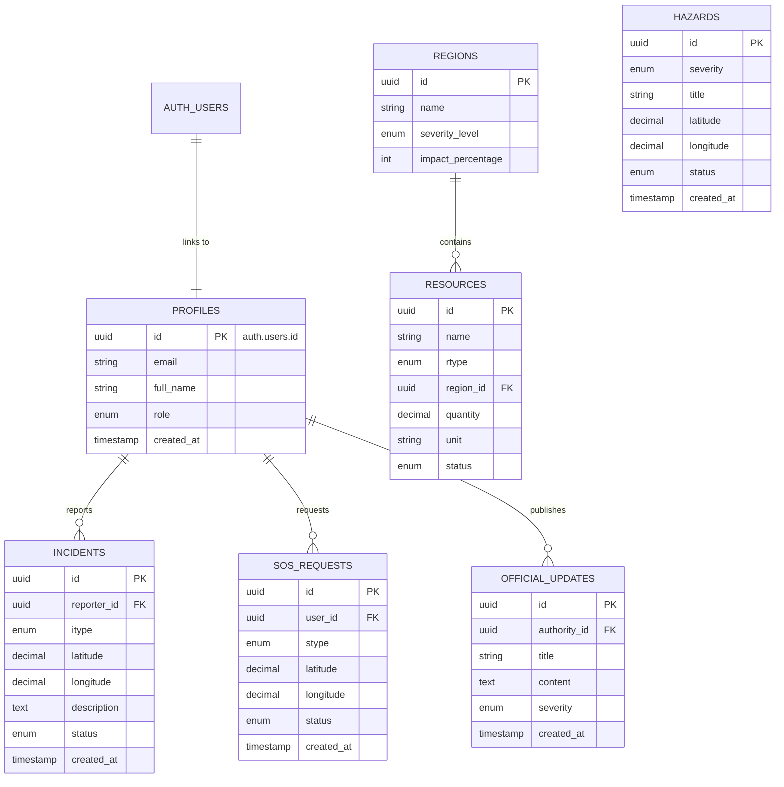

# Outbreak System: Database Architecture (Supabase Edition)

This architecture is optimized for **Supabase**, leveraging its native Auth system and PostgreSQL capabilities for real-time disaster management.

## Visual Entity Relationship Diagram


## Normalization Analysis

The database is designed to be in **3rd Normal Form (3NF)**, ensuring data integrity and minimizing redundancy.

- **1st Normal Form (1NF)**: All columns contain atomic values, and there are no repeating groups. Each table has a unique primary key.
- **2nd Normal Form (2NF)**: The schema is in 1NF and all non-key attributes are fully functionally dependent on the primary key. Since we use single-column UUIDs as primary keys, partial dependencies are naturally avoided.
- **3rd Normal Form (3NF)**: The schema is in 2NF and there are no transitive dependencies. All non-key fields (like `full_name`, `latitude`, `title`) depend directly on their respective primary keys and not on any other non-key attributes.

## Structure Overview (Mermaid)



## Architectural Highlights

### 1. Supabase Auth Integration
Instead of a custom `users` table, we use a `profiles` table in the `public` schema. This table uses the same primary key as Supabase's internal `auth.users` table, ensuring seamless integration with authentication flows.

### 2. Role-Based Access Control (RBAC)
User roles (`citizen`, `community_supporter`, `authority`) are stored in the `profiles` table. This allows the application to restrict access to specific dashboards and actions based on the user's role.

### 3. Geospatial Readiness
The schema includes high-precision `DECIMAL` fields for `latitude` and `longitude`, allowing for accurate mapping of incidents and hazards. This is designed to support future PostGIS integration if complex spatial queries (like "find all responders within 10km of a surge") are required.

### 4. Automated Housekeeping
Triggers are included in the SQL schema to automatically update `updated_at` timestamps, ensuring that the frontend always displays the most current data status.

### 5. Integrity Constraints
Strong foreign key relationships and ENUM types prevent data corruption. For example, an SOS request cannot exist without a valid user profile, and impact levels are restricted to valid disaster severity categories.

---

## Reporting & Analytics Potential

The current schema is highly optimized for generating strategic reports and real-time dashboards. Below are examples of how this data can be utilized for report generation:

### 1. Incident Frequency & Trend Analysis
By querying the `incidents` table, authorities can identify which types of disasters (Flooding, Landslide) are increasing in frequency over specific time periods.

**Sample SQL:**
```sql
SELECT itype, COUNT(*) as incident_count, DATE_TRUNC('day', created_at) as day
FROM incidents
GROUP BY itype, day
ORDER BY day DESC;
```

### 2. Regional Impact Heatmaps
Using `latitude` and `longitude` from `incidents`, `sos_requests`, and `hazards`, the system can generate visual heatmaps to identify "Hot Zones" that require immediate attention.

### 3. Resource Allocation Reports
Combining `resources` and `regions` allows for a Gap Analysis report, showing where supplies (e.g., Medical kits) are low relative to high-severity `regions`.

**Sample SQL:**
```sql
SELECT r.name as region, rs.name as supply, rs.quantity, rs.status
FROM regions r
JOIN resources rs ON r.id = rs.region_id
WHERE r.severity_level IN ('High', 'Critical') AND rs.status = 'low';
```

### 4. Response Efficiency (SLA) Tracking
By comparing `created_at` and `updated_at` (when status changes to 'resolved'), the system can calculate the Average Response Time for SOS requests and high-priority incidents.

**Sample SQL:**
```sql
SELECT stype, AVG(updated_at - created_at) as avg_resolution_time
FROM incidents
WHERE status = 'resolved'
GROUP BY stype;
```

### 5. Public Safety Reach
Tracking `official_updates` helps measure the volume of communication sent to the public during active disaster phases, categorized by `severity` (info vs urgent).
