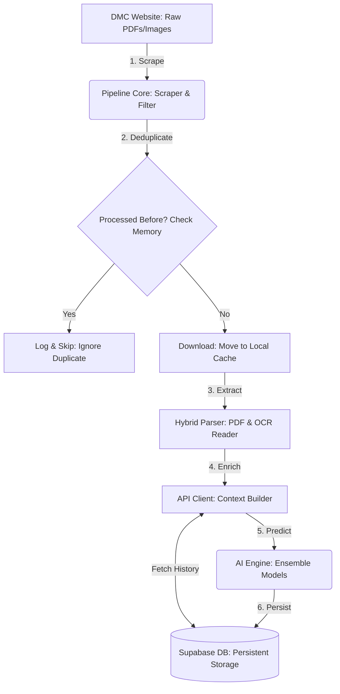

# Data Pipeline: Deep Dive Flow & Logic

This guide provides a detailed technical breakdown of the Outbreak data pipeline. It explains how raw government reports are transformed into actionable AI insights while ensuring data integrity.

---

## 1. The Operational Lifecycle
The pipeline is designed to be **Idempotent** (safe to run multiple times) and **Self-Healing** (recovers from missed cycles).

### Graph Legend & Data Behavior

| Component | Function | Data Behavior |
| :--- | :--- | :--- |
| **A. DMC Website** | The external source of truth. | Contains **raw files** (.pdf, .jpg). Data is static and unstructured. |
| **B. Pipeline Core** | The Scraper & Filter. | It converts the website's HTML into a **list of potential URLs**. |
| **C. Decision Point** | Check Memory. | Compares URLs against `pipeline_state.json`. It filters out data we already have. |
| **D. Log & Skip** | Ignore Duplicate. | Data is discarded here. Only a log message is created. |
| **E. Download** | Move to Local Cache. | The raw file is moved from the internet to our **local temporary storage**. |
| **F. Hybrid Parser** | PDF & OCR Reader. | **Crucial Step**: Converts a visual file (PDF/Image) into a **Python Dictionary** (structured text and numbers). |
| **G. API Client** | Context Builder. | It takes the raw numbers and **bundles** them with historical data (the last 12-24 hours) to create a **"Context Window."** |
| **H. Supabase DB** | Persistent Storage. | **Input**: Receives finished reports. **Output**: Provides previous records to help predict current ones. |
| **I. AI Engine** | Ensemble Models. | Receives a history window and outputs **three prediction values** (1h, 12h, 24h). |

---

## 2. Technical Step-by-Step Breakdown

### Step 1: Link Discovery & Filtering
The pipeline visits the DMC Report portal.
*   **Targeting**: It looks for links containing `/images/dmcreports/` and keywords like `water`, `level`, or `hrs`.
*   **Filtering**: It checks the `pipeline_state.json` file. This file acts as the system's "memory," storing the URL of every report ever processed.
*   **Safety Limit**: To prevent performance spikes, the system only processes a maximum of **10 new reports** per cycle, prioritizing the most recent ones.

### Step 2: Hybrid Extraction Strategy
Since government reports can be digital PDFs or scanned images, the system uses a fallback strategy:
1.  **Digital Parsing (`pdfplumber`)**: Attempts to extract structured tables from the PDF metadata. This is the primary method as it is 100% accurate for numbers.
2.  **OCR Fallback (`EasyOCR`)**: If the PDF is a scanned image, the system:
    *   Detects text boxes.
    *   **Spatial Grouping**: Groups text boxes that share similar Y-axis coordinates (within 20 pixels) to reconstruct the table rows.
    *   **Coercion**: Cleans the text to extract floating-point numbers (e.g., converting `"4. 5m"` into `4.5`).

### Step 3: History & Context Enrichment (The "Context Window")
The AI models cannot predict the future using only one data point. They need to see the "path" or the trend of the river. 

**What is a Context Window?**
Think of it like a **video clip** vs. a **still photo**:
- **Still Photo (One Data Point)**: You see the water is at 5 meters. You don't know if it's rising or falling.
- **Video Clip (Context Window)**: you see the water was at 3m, then 4m, now 5m. Now you know it's rising fast.

**How it works in the code:**
*   **History Fetching**: The `APIClient` queries Supabase for the last 12-24 records of the station.
*   **Bundling**: It creates a list (a "window") of these records.
*   **Lag Calculation**: It calculates `water_level_lag1` (level 1 hour ago) and `water_level_lag2` (level 2 hours ago).
*   **Result**: This "Window" is what is sent to the AI so it can "see" the trend.

### Step 4: Multi-Model AI Inference
The enriched data (current level + history) is sent to the **Forecasting Engine**.
*   **Validation**: If less than 12 hours of history exists, the engine performs **Edge Padding** (repeating the oldest record) to satisfy the model's input requirements.
*   **Ensemble Response**: The engine returns three distinct forecasts:
    *   **1h (Early Warning)**: High-speed detection of flash floods.
    *   **12h (Trend Monitor)**: Predicts the immediate rise/fall trend.
    *   **24h (Strategic Path)**: Long-term outlook for planning evacuations.

### Step 5: Persistence via PostgREST
The combined data (Raw Extraction + AI Forecasts) is sent to Supabase.
*   **Interface**: Uses a standard HTTP POST to the `/river_reports` endpoint.
*   **Metadata**: The system attaches a `timestamp`, `hour`, and `month` to allow the dashboard to render time-series charts correctly.

---

## 3. Data Integrity & Safety

### How We Prevent Duplicates
Deduplication happens at the **Source URL** level. 
Because every report on the DMC website has a unique filename (e.g., `Water_Level_0900.pdf`), we use that filename as a unique key. Once that key is in `pipeline_state.json`, the pipeline will never "touch" that file again, even if you run the script every minute.

### Handling Edge Cases
| Scenario | System Behavior |
| :--- | :--- |
| **Website Down** | Logs a "Connection Error" and exits gracefully. No data is lost; it will catch up on the next run. |
| **Empty Report** | If no water levels are found in a PDF, the URL is still marked as "Processed" to avoid infinite retries on a broken file. |
| **Missing History** | If a station is brand new, the system uses the current water level as its own "Lag," allowing the AI to start predicting immediately. |

---

## 4. Summary of Key Components

*   **`pipeline_state.json`**: The persistent record of processed URLs.
*   **`latest_history.json`**: A local cache used to maintain continuity between runs.
*   **`water_levels_global_ml_mapping.csv`**: Maps inconsistent names (e.g., "Hanwella (Ext)") to fixed IDs.
