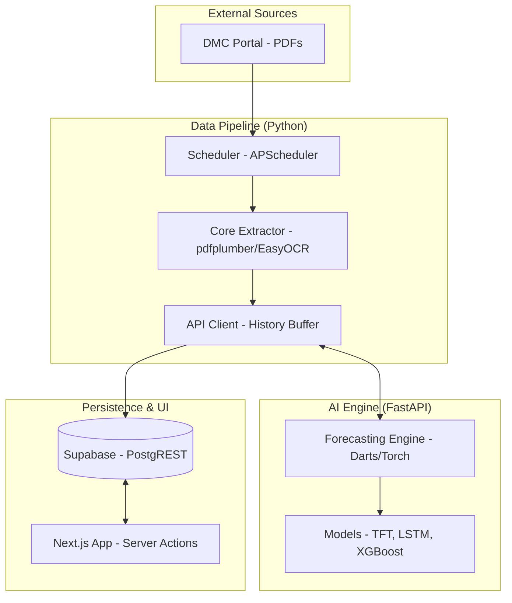
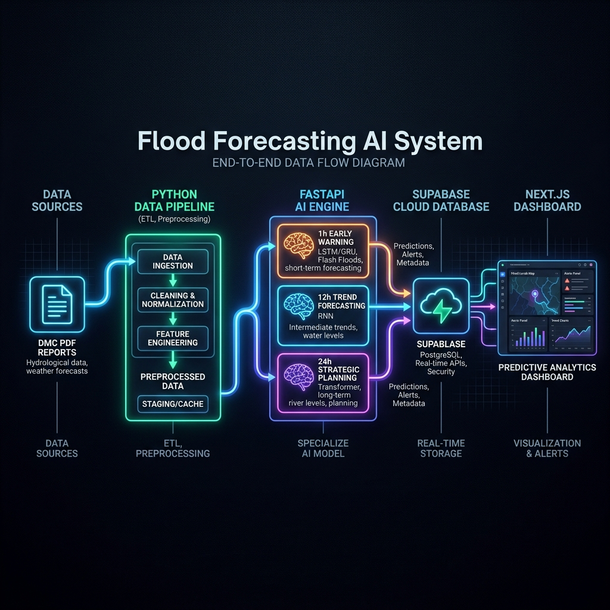

# Technical Deep Dive: Outbreak Flood Forecasting System
*Architectural Overview, Engineering Guide, and Technical Glossary*

This document provides a comprehensive technical walkthrough of the Outbreak platform's automated forecasting system. It is designed for engineers and developers who are new to AI pipeline orchestration but familiar with software development and the IT industry.

> [!TIP]
> For a detailed breakdown of the internal data flow, state management, and deduplication logic, see the [Data Pipeline Flow & Behavior](./DATA_PIPELINE_FLOW.md) guide.


---

## 1. Technical Glossary (The "Jargon" Guide)

To understand this system, it is helpful to be familiar with these common AI and Data Engineering terms:

- **Inference**: The process of running live data through a pre-trained model to generate a prediction (e.g., "The water level will be 5.2m in one hour").
- **Look-back Window (Context Length)**: The amount of historical data the model needs to analyze before it can predict the future. Our system requires a window of **12 historical records**.
- **Edge Padding**: A technique used when we don't have enough history. We "pad" the missing data by repeating the oldest available record until we reach the required window size (12).
- **OCR (Optical Character Recognition)**: The technology used to "read" text inside an image. We use this when the government publishes reports as scanned images instead of digital PDFs.
- **Ensemble**: A strategy that uses multiple different AI models together. Instead of one "jack-of-all-trades" model, we use three specialists (XGBoost, LSTM, and TFT).
- **Type Coercion**: The act of forcing data into a specific format (e.g., converting a string `"5.2"` into a float `5.2`) so that mathematical models can process it.
- **PostgREST**: A tool that automatically turns a database (PostgreSQL) into a RESTful API, allowing us to fetch and save data using standard HTTP requests (GET/POST).
- **Recursive Forecasting**: A method where a model predicts the next hour, then uses that prediction as an input to predict the hour after that, repeating this until it reaches a 24-hour horizon.
- **Lag Features**: Using values from the *past* (e.g., the water level 1 hour ago) as inputs for the *current* prediction. Our system automatically calculates `water_level_lag1` and `water_level_lag2`.

---

## 2. System Architecture

> [!NOTE]
> The diagram below is written in **Mermaid** (Diagrams-as-Code). This allows us to track changes to the architecture just like we track code. If your viewer doesn't render it automatically, please refer to the high-resolution image provided below.



### Visual Breakdown


### High-Level Flow Chart (Summary)
| Step | Phase | Responsibility | Tool/Tech |
| :--- | :--- | :--- | :--- |
| **1** | **Acquisition** | Scrapes government bulletins (PDFs/Images). | `BeautifulSoup`, `requests` |
| **2** | **Extraction** | Extracts text/numbers from files. | `pdfplumber`, `EasyOCR` |
| **3** | **Enrichment** | Adds historical lags (previous water levels). | `pandas`, `Supabase API` |
| **4** | **Inference** | Predicts 1h, 12h, and 24h risk. | `FastAPI`, `Darts`, `XGBoost` |
| **5** | **Storage** | Persists data for the web application. | `PostgREST`, `Supabase Cloud` |
| **6** | **Display** | Renders insights with interactive charts. | `Next.js`, `Lucide Icons` |

---

## 3. Data Acquisition & Preprocessing (`/data-pipeline`)

The ingestion layer handles the transition from unstructured government PDF reports to structured, AI-ready dataframes.

### Hybrid Extraction Strategy (`pipeline_core.py`)
Government reports vary in format. Our system uses a **weighted fallback strategy**:
1. **Digital Parsing (`pdfplumber`)**: First, we attempt to extract table objects directly from the PDF's internal metadata. This is fast and precisely captures floating-point numbers.
2. **OCR Fallback (`EasyOCR`)**: If no tables are found, we render the page as an image. We then use `EasyOCR` to detect text boxes. We group these boxes by their Y-axis coordinates (spatial grouping) to reconstruct rows and columns manually.

### Data Normalization & Mapping
Names in government reports are often inconsistent. We use **Fuzzy String Matching** (using `pandas.str.contains(case=False)`) to link a station like "Hanwella (Ext)" to its official `station_id` (21) in our mapping file.

---

## 4. The Inference Engine (`/forecasting-engine`)

The engine is a **FastAPI** service wrapper around models built with the **Darts** library.

### The Prediction Workflow (`main.py`)
When the pipeline hits the `/predict` endpoint:
1. **Validation & Padding**: The engine checks the input list. If fewer than 12 records are provided, it performs **Edge Padding** (repeating `records[0]`) to ensure the PyTorch tensors have the correct shape.
2. **Feature Engineering**: It calculates `time_idx` (a sequential integer required by Transformers) and ensures temporal features like `hour` and `month` (Calculated using the `datetime` of the report) are correctly cast as integers.
3. **Model Execution**:
   - **XGBoost (Early Warning)**: A gradient-boosted tree model. It is extremely fast and effective at identifying abrupt changes in tabular data.
   - **LSTM (Trend Monitor)**: A Recurrent Neural Network (RNN) that maintains an internal "cell state" to remember how the river has been trending over multi-hour cycles.
   - **TFT (Strategic Path)**: A state-of-the-art Transformer model. It uses **Multi-Head Attention** to determine which past events (like an upstream dam release) are most relevant to the future 24-hour outlook.

---

---

## 5. Persistence & Integration (The Supabase Layer)

Supabase serves as the "Common Data Environment" (CDE) that bridges the gap between our local Python processing and our global web presence.

### Why Supabase? (The Strategy)
- **Unified Source of Truth**: Instead of the Python pipeline and the Web Dashboard having separate databases, they both talk to the same cloud-hosted PostgreSQL instance.
- **API Acceleration**: Using Supabase's **PostgREST** feature allowed us to eliminate an entire backend service layer. We don't need to write an Express.js or Django API because the database *is* the API.
- **Infrastructure Simplicity**: We don't have to manage connection pools, SQL migrations, or server maintenance—it's all handled by the Supabase platform.
- **Relational Integrity**: Unlike a JSON file or a flat CSV, Supabase ensures that every "River Report" is linked to a valid "Station ID," preventing data corruption.

### How Supabase Integrates (The Workflow)

Supabase acts as a bi-directional bridge between the **Producer** (Python Pipeline) and the **Consumer** (Next.js Dashboard).

#### 1. The Writer (Python Pipeline)
The Python `APIClient` does not use a complex SQL driver. Instead, it interacts with Supabase via standard **HTTP REST** requests.
*   **Authentication**: It uses the `SUPABASE_SERVICE_ROLE_KEY` in the HTTP header: `Authorization: Bearer <KEY>`.
*   **The Action**: When a new forecast is generated, the pipeline performs an **Upsert** (Update or Insert) to the `/rest/v1/river_reports` endpoint.
```python
# Conceptual How-To (Python)
headers = {"Authorization": f"Bearer {KEY}", "Content-Type": "application/json"}
requests.post(SUPABASE_URL + "/rest/v1/river_reports", json=report_payload, headers=headers)
```

#### 2. The Storage (PostgreSQL)
Inside Supabase, the data is stored in the `river_reports` table. This table is optimized for time-series data, allowing us to quickly fetch the "latest 12 hours" of history for any of the 22 stations.

#### 3. The Reader (Next.js Dashboard)
The web application uses the `@supabase/supabase-js` library to pull data directly into the UI.
*   **Server Actions**: Instead of a traditional API call, the dashboard uses Next.js Server Actions (`forecasting.ts`) to query the database directly during the page load.
*   **The Query**: It filters by `station_id` and pulls the latest records ordered by `timestamp`.
```typescript
// Conceptual How-To (TypeScript)
const { data } = await supabase
  .from("river_reports")
  .select("*")
  .eq("station_id", 21)
  .order("timestamp", { ascending: false })
  .limit(12);
```

### The History Buffer & Lag Calculation (`api_client.py`)
The `APIClient` class is responsible for "closing the loop" between the raw data and the AI.
1. **Fetching Lags**: For every new report, the client queries Supabase for the *prevous* record of that station to calculate `water_level_lag1`. If no previous record exists, it uses the current value as a baseline.
2. **Buffering**: It maintains a local `latest_history.json` file to keep a rolling 24-hour history window for local model debugging and quick inference calls.
3. **Upsert Logic**: It uses specific HTTP headers (`Prefer: return=minimal`) to efficiently `POST` combined raw data and AI forecasts into the `river_reports` table.

### Frontend Rendering (`onlineMode`)
The React dashboard renders a high-performance SVG chart to visualize the results:
- **Server Actions**: `app/actions/forecasting.ts` fetches the latest 12 reports directly into the React component.
- **Dynamic Boundary Scaling**: The dashboard calculates the `Min` and `Max` water levels in real-time, including the AI's predicted peaks, ensuring the graph always fits perfectly on any screen size.
- **Role Highlights**:
  - <span style="color:#e11d48">●</span> **XGBoost (Solid Red)**: High-confidence 1h warning.
  - <span style="color:#ea580c">●</span> **LSTM (Dashed Orange)**: Indicates the 12h predicted trend.
  - <span style="color:#d97706">●</span> **TFT (Dashed Amber)**: The long-term 24h strategic forecast.

---

## 6. Real-World Examples & Scenarios

### Example 1: The Life of a Data Point
1. **At 12:00 PM**: A sensor at **Hanwella** measures 4.5 meters.
2. **At 12:15 PM**: The DMC publishes `Water_Level_1200.pdf`.
3. **At 12:35 PM**: Our `scheduler.py` wakes up and detects the new file.
4. **Extraction**: `pipeline_core.py` reads the PDF and extracts: `{"station": "Hanwella", "level": 4.5}`.
5. **Enrichment**: `api_client.py` looks at the database, sees the *previous* reading was 4.2m, and adds `"water_level_lag1": 4.2`.
6. **AI Magic**: The engine receives the last 12 hours of data and replies: `{"forecast_1h": 4.8}`.
7. **Storage**: A single JSON record is saved to Supabase: `{"station_id": 21, "water_level_now": 4.5, "forecast_1h": 4.8, ...}`.
8. **Visualization**: Within seconds, the dashboard on your screen updates the red dotted line upward to 4.8m.

### Example 2: OCR Logic (Handling Poor Scans)
Imagine a PDF that is just a blurry photo of a paper table.
- **Without Spatial Grouping**: The computer might see a `"4"` at coordinates (100, 200) and a `".5"` at (105, 201) and think they are different things.
- **With Our Logic**: The code looks at the Y-axis (200 vs 201). Since the difference is less than 20 pixels, it knows they belong on the same line. It joins them into `"4.5"` and assigns it to the station found on that same horizontal row.

### Example 3: AI Inference Payload (Technical JSON)
When the Pipeline talks to the AI Engine, it sends a structured window like this:
```json
[
  {
    "station_id": 21,
    "hour": 9,
    "water_level_now": 4.0,
    "water_level_lag1": 3.8,
    "rainfall_roll3": 12.5
  },
  "... (10 more records) ...",
  {
    "station_id": 21,
    "hour": 12,
    "water_level_now": 4.5,
    "water_level_lag1": 4.4,
    "rainfall_roll3": 25.0
  }
]
```
The Engine responds with the **ensemble results**:
```json
{
  "success": true,
  "forecasts": {
    "early_warning_1h": 4.82,
    "trend_monitor_12h": 5.15,
    "strategic_path_24h": 4.90
  }
}
```

### Example 4: The History Buffer & Lag Continuity
If the DMC stops reporting for 6 hours and then starts again, our system needs to stay stable:
- **Continuity**: The `APIClient` checks the DB for the *last known* level of that station, even if it was hours ago, to ensure the "lag" feature (previous state) reflects the true physical transition of the river.
- **Statelessness**: Because the engine only remembers the 12 records you send it *right now*, we can restart the server at any time without losing the "memory" of the flood.

---

## 7. End-to-End Data Lifecycle (The Workflow)

This summary traces the transformation of data from a government bulletin to a citizen-facing insight.

| Stage | Data Format | Origin | Destination | Action |
| :--- | :--- | :--- | :--- | :--- |
| **1. Ingestion** | **Binary (.pdf)** | DMC Website | Local `/tmp` Storage | `scheduler.py` detects a new file and downloads the raw PDF. |
| **2. Extraction** | **Memory (Dict)** | Local `.pdf` | `pipeline_core.py` | Text/Images are parsed into a specialized Python dictionary. |
| **3. Enrichment** | **SQL Rows** | Supabase DB | `api_client.py` | The code fetches the *last 12 rows* from the database to build a "context window." |
| **4. Inference** | **JSON Payload** | Data Pipeline | AI Engine (FastAPI) | A JSON array is sent over HTTP; a JSON forecast object is returned. |
| **5. Buffering** | **Local JSON** | AI Engine | `latest_history.json` | A local cache is updated to ensure we have a fallback if the DB is slow. |
| **6. Persistence** | **SQL Row** | Data Pipeline | Supabase (Postgres) | A single JSON `POST` request creates a permanent **Database Row**. |
| **7. Execution** | **React State** | Supabase DB | `forecasting.ts` | The Next.js Server Action fetches the rows and passes them to the UI. |
| **8. Display** | **Visual (SVG)** | Dashboard UI | User Screen | The data is rendered as a clean, interactive line chart. |

---

## 8. Concrete Data Examples (Step-by-Step)

To help you visualize the system in action, here are the exact data structures used at each stage for **Hanwella Station (ID: 21)**.

### A. The Extracted Data (From Pipeline)
After reading the PDF, the pipeline creates this simple dictionary in memory:
```json
{
  "station_id": 21,
  "river_id": 1,
  "water_level_now": 4.50,
  "alert_level": 4.0,
  "minor_flood": 6.0,
  "major_flood": 8.0,
  "rainfall": 15.5
}
```

### B. The AI Inference Request (To Engine)
The pipeline then retrieves history and sends a **Window of 12 Records** to the AI. This is what the AI "sees":
```json
[
  {
    "station_id": 21,
    "hour": 10,
    "month": 4,
    "water_level_now": 4.25,
    "water_level_lag1": 4.10,
    "water_level_lag2": 4.05,
    "rainfall_roll3": 10.0
  },
  "... (9 more rows) ...",
  {
    "station_id": 21,
    "hour": 13,
    "month": 4,
    "water_level_now": 4.50,
    "water_level_lag1": 4.45,
    "water_level_lag2": 4.30,
    "rainfall_roll3": 15.5
  }
]
```

### C. The AI Engine Response
The Engine processes the window and returns its specialized forecasts:
```json
{
  "success": true,
  "forecasts": {
    "early_warning_1h": 4.82,
    "trend_monitor_12h": 5.15,
    "strategic_path_24h": 4.90
  },
  "is_anomaly": false
}
```

### D. The Final Database Record (To Supabase)
Finally, the pipeline merges everything into a single row to be saved forever:
```json
{
  "station_id": 21,
  "river_id": 1,
  "hour": 13,
  "month": 4,
  "water_level_now": 4.50,
  "water_level_lag1": 4.45,
  "water_level_lag2": 4.30,
  "rainfall_roll3": 15.5,
  "forecast_1h": 4.82,
  "forecast_12h": 5.15,
  "forecast_24h": 4.90,
  "is_anomaly": false
}
```

---

## 9. Full Prediction Cycle Walkthrough: "The Hanwella Event"

Let's walk through one real-world cycle of a station entering a flood state.

1.  **DMC Update**: At 2:00 PM, the river rises to **5.8m** (approaching Minor Flood). The DMC website updates with a new report.
2.  **Detection**: The scheduled Python script sees the update and downloads `Report_1400.pdf`.
3.  **Parsing**: The system reads the PDF, finds "Hanwella", and extracts **5.8m**.
4.  **Enrichment**: The `APIClient` fetches the 1:00 PM level (5.5m) and the 12:00 PM level (5.2m) to calculate **Lags**.
5.  **Forecasting**:
    - **XGBoost** sees the sharp rise from 5.2 -> 5.5 -> 5.8 and predicts a **6.1m** level for 3:00 PM (Crossing Minor Flood).
    - **LSTM** looks at the 12-hour trend and determines the water will likely peak at **6.5m** by midnight.
    - **TFT** calculates that based on current rainfall, the river will stabilize at **5.9m** within 24 hours.
6.  **Persistence**: These 3 different viewpoints are bundled into one record and saved to Supabase.
7.  **Alerting**: Your Dashboard instantly refreshes. The Hanwella chart now shows a solid red line (Current) at 5.8m, but a **dotted warning line** jumping up to 6.1m, giving responders a 60-minute head start.
